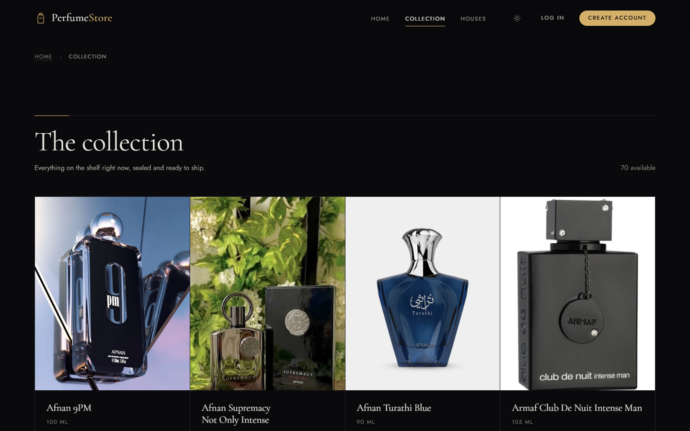
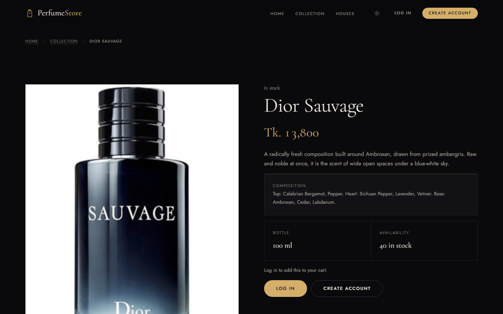
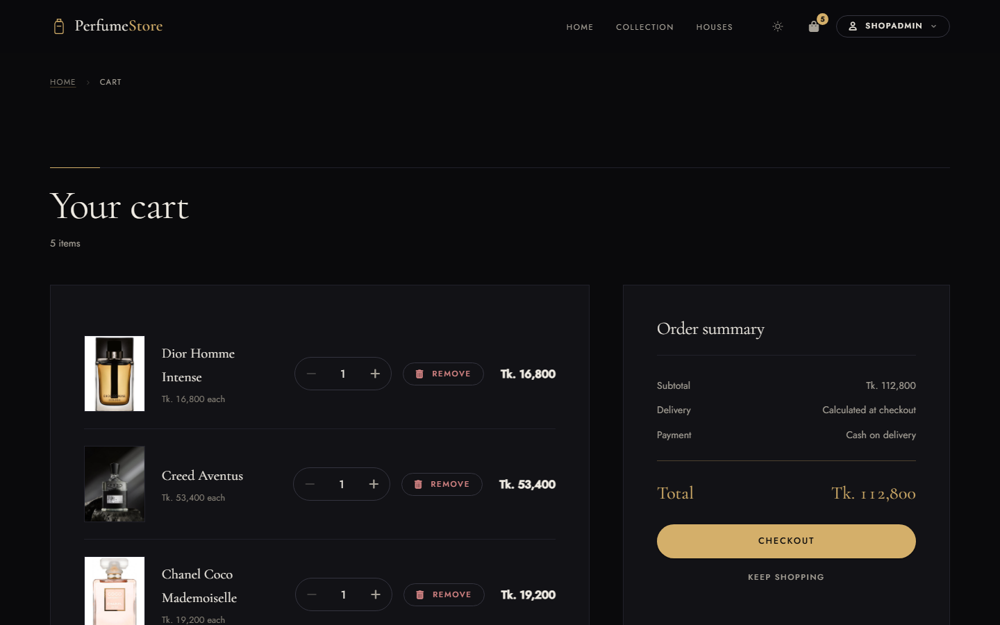
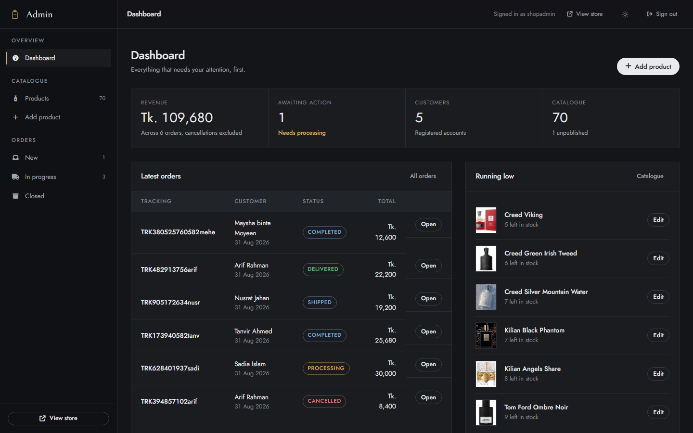
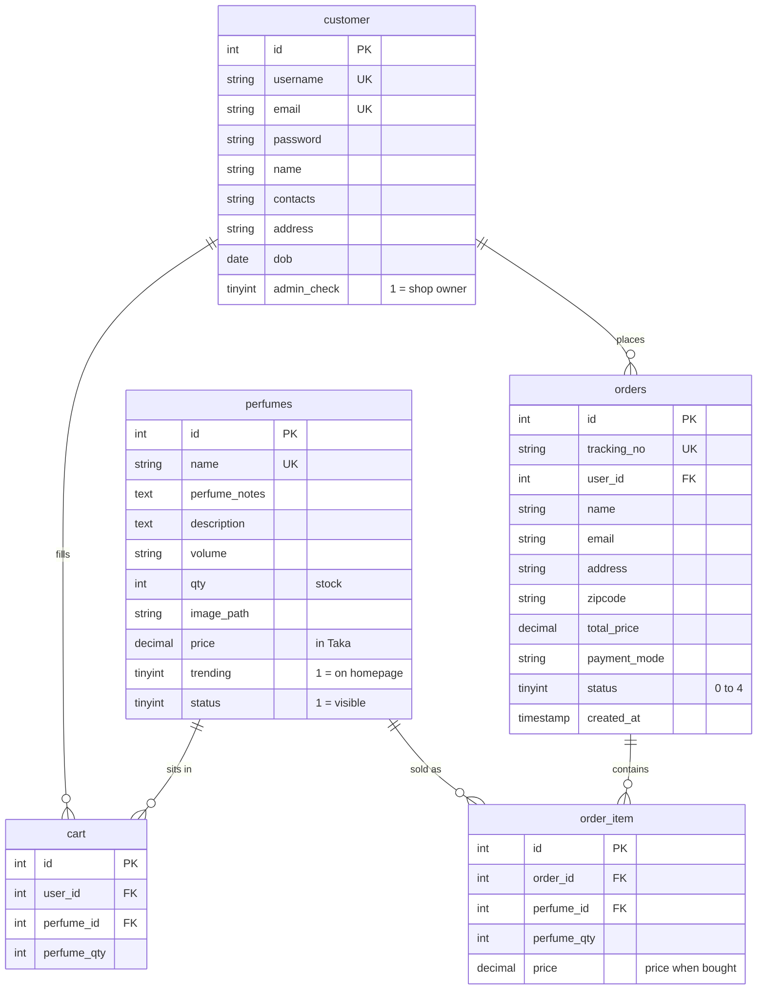

<div align="center">

# Perfume Store

**An online fragrance shop.** Browse designer and niche perfumes, add them to a cart,
and check out with cash on delivery. Shop owners get a private admin panel to manage
the catalogue and fulfil orders.

**Live Demo:** [https://perfumestore.kesug.com/](https://perfumestore.kesug.com/)

*This project is a modern revamp of the legacy project: [cse311-perfume-store](https://github.com/mehenuf/cse311-perfume-store).*

[](https://www.php.net/)
[](https://www.mysql.com/)
[](https://www.postgresql.org/)
[](https://developer.mozilla.org/en-US/docs/Web/CSS)
[](https://developer.mozilla.org/en-US/docs/Web/JavaScript)


</div>

---


---

## What is this?

It's a working online shop for perfume, built the straightforward way: PHP pages that
talk to a MySQL database. No frameworks, no build tools, no `npm install`. If you can
run XAMPP, you can run this.

There are two sides to it:

**The Shop** — what customers see. They browse fragrances, filter by brand,
read the scent notes, add bottles to a cart, and place an order. They can then track
that order through to delivery.

**The Admin Panel** — what you see. Add new perfumes with photos, edit prices and
stock, hide products without deleting them, and move orders along from *Processing*
to *Delivered*.

---

## Features

<table>
<tr>
<td width="50%" valign="top">

### For Shoppers

- Browse 71 fragrances across 20 houses
- View top, heart, and base notes for every fragrance
- Persistent cart that remembers you between visits
- Cash-on-delivery checkout system
- Order tracking with a unique tracking number
- Fully responsive design for mobile and desktop
- Light and dark themes supported and remembered

</td>
<td width="50%" valign="top">

### For the Shop Owner

- Add perfumes with image upload functionality
- Edit prices, stock quantities, and descriptions
- Publish or unpublish items without deletion
- Flag selected bottles as trending for the homepage
- View all orders with complete delivery details
- Update order statuses as items are shipped
- Stock levels decrease automatically upon each sale

</td>
</tr>
</table>

---

## A Look Around

| The Collection | A Product Page |
|:--:|:--:|
|  |  |
| **The Cart** | **The Admin Panel** |
|  |  |
| **On a Phone** | |
|  | |

---

## Built With

| Component | Description | Rationale |
|---|---|---|
| **PHP 8** | The language the pages are written in | Runs on almost any cheap or free host |
| **MySQL / MariaDB** | Where products, users and orders are stored | The standard pairing with PHP |
| **PostgreSQL** | An alternative database | Schema included if you prefer it |
| **Plain CSS** | All the styling, one file | No framework, so nothing to install or update |
| **Vanilla JavaScript** | Cart actions, menus, animations | No jQuery, no libraries, ~12KB total |
| **Font Awesome** | The icons | Loaded once from a CDN |
| **Cormorant Garamond + Jost** | The two fonts | Free from Google Fonts |

**Zero npm packages. Zero build step.** Edit a file, refresh the browser, done.

---

## Getting It Running Locally

You'll need [XAMPP](https://www.apachefriends.org/) (or any Apache + PHP + MySQL setup).

### 1. Put the files in place

Copy this folder into your XAMPP web directory so you end up with:

```
C:\xampp\htdocs\perfumestore\
```

### 2. Start Apache and MySQL

Open the XAMPP Control Panel and hit **Start** on both.

### 3. Create the database

Go to <http://localhost/phpmyadmin>, then:

1. Click **New** in the left sidebar
2. Name it `perfumestore`, set collation to `utf8mb4_unicode_ci`, click **Create**
3. With `perfumestore` selected, open the **Import** tab
4. Upload `database/mysql/01_schema.sql` and click **Import** — this builds the tables
5. Import `database/mysql/02_seed.sql` the same way — this fills them with products

> Note: Order matters. The schema file has to run before the seed file.

### 4. Open the shop

<http://localhost/perfumestore/>

That's it. No config needed — the app defaults to XAMPP's standard settings.

### 5. Log in

| User Role | Username | Password |
|---|---|---|
| Shop Owner | `shopadmin` | `admin123` |
| Customer | `arif` | `arif1234` |

The admin panel is at `/admin` once you're logged in as the shop owner.

> Note: **Change these before showing anyone.** See [Security](#security-before-you-go-public).

---

## Putting It Online For Free

The short version: **Vercel and Netlify can't run this.** They serve static files and
JavaScript functions — they don't run PHP, and the admin photo uploads need a real
disk that keeps files between visits.

What works, for free:

| | Hosting | Database | Good for |
|---|---|---|---|
| **Easiest** | InfinityFree | Included, same account | Getting live in about 30 minutes |
| **More control** | Render or Koyeb | Aiven or TiDB Cloud | If you want a modern cloud setup |

Full click-by-click instructions, including screenshots of where each setting lives,
are in **`DEPLOYMENT.md`**.

---

## How the Data is Organised

Five tables. A customer has a cart and places orders; each order is made of order items;
every cart line and order item points at a perfume.



**Order status** goes `0` Processing → `1` Completed → `2` Shipped → `3` Delivered,
with `4` Cancelled.

A few deliberate choices worth knowing about:

- **Order history is protected.** A customer who has ordered can't be deleted, and
  a perfume that has ever sold can't be deleted either. Hide it instead by unticking
  *Status*, which shows it as *Unpublished*.
- **Prices are frozen at purchase.** `order_item` stores what the customer actually
  paid, so changing a price later never rewrites an old receipt.
- **All prices are in Bangladeshi Taka**, converted from international retail
  prices at 1 USD = 120 BDT.

---

## What's in the Folders

```
perfumestore/
│
├── index.php               the homepage
├── perfumes.php            the full collection
├── brands/                 one page per house, 20 of them
├── display-perfume.php     a single product
├── shoppingcart.php        the cart
├── checkout.php            place an order
├── orders.php              a customer's past orders
├── login.php  register.php sign in and sign up
│
├── admin/                  the shop owner's panel
├── config/                 database connection settings
├── functions/              database queries and form handling
├── includes/               shared header, nav, footer, product card
├── assets/                 the stylesheet, the JavaScript, banner images
├── images/                 product photos
│
└── database/
    ├── mysql/              schema + starting data for MySQL
    └── postgres/           the same, for PostgreSQL
```

---

## Checking Everything Works

Two scripts come with the project. Both need Python, and neither touches your live site.

```bash
python database/verify.py
```

Loads the database schema into a temporary in-memory copy and runs **31 checks** —
that every table has a proper key, that nothing points at a missing row, that order
totals match their line items, and that every product photo actually exists.

```bash
python tools/audit_frontend.py
```

Runs **33 checks** on the pages themselves — that no HTML tag is left unclosed, that
every linked file exists, that there are no duplicate element IDs, that reduced-motion
support is in place, and that every text colour clears the WCAG AA contrast minimum
against every background it can sit on, in all four palettes.

It also pins down bugs that have actually shipped here, so they cannot come back: no
image may be hidden by CSS and revealed only by JavaScript, and every local stylesheet
and script must carry a cache-busting version stamp.

Both currently pass.

---

## Security: Before You Go Public

This started as a college project, and two things in it are fine for a demo but **not
safe for a real shop taking real orders**:

| Issue | What it means | The fix |
|---|---|---|
| **Passwords are stored as plain text** | Anyone who gets a copy of the database can read every customer's password | Switch to PHP's `password_hash()` and `password_verify()` |
| **SQL injection is possible** | A crafted web address could read or damage the database | Rewrite the queries to use prepared statements |

Neither is hard to fix, and `DEPLOYMENT.md` walks through both. **Do them before you
accept a single real order.**

---

## Ideas for Later

- [ ] Hash passwords and switch to prepared statements
- [ ] Search box and price/brand filters
- [ ] Wishlist (the button exists, it doesn't do anything yet)
- [ ] Customer reviews and ratings
- [ ] Online payment as well as cash on delivery
- [ ] Email confirmation when an order is placed
- [ ] Sales dashboard for the admin (the current one shows sample figures)

---

## Credits

Product photography and brand names belong to their respective fragrance houses and
are used here for demonstration only. A product only carries a photograph when that
photograph actually shows it, and no listing is ever given another house's bottle. A
product added without a photo gets a designed *Photography pending* tile rather than a
broken image. Icons by [Font Awesome](https://fontawesome.com/),
type by [Google Fonts](https://fonts.google.com/).

---

## License

**All Rights Reserved**

This project and its source code are proprietary. You may not copy, modify, distribute, or use this project for yourself or commercially without explicit written permission.

For any inquiries, permissions, or to discuss using this project, please contact me directly at: **[mehenuf.me](https://mehenuf.me)**

<div align="center">

**Built by Mehenuf Hossain Bhuiyan**

</div>
