<div align="center">

# Perfume Store

**An online fragrance shop.** Browse designer and niche perfumes, filter by brand,
gender, and price, add them to a cart, and check out with cash on delivery or an
online gateway (card, mobile wallet, or crypto). Shop owners get a private admin
panel to manage the catalogue and fulfil orders.

**Live Demo:** [https://perfumestore.kesug.com/](https://perfumestore.kesug.com/)

*This project is a modern revamp of the legacy project: [cse311-perfume-store](https://github.com/mehenuf/cse311-perfume-store).*

[](https://www.php.net/)
[](https://www.mysql.com/)
[](https://www.postgresql.org/)
[](https://developer.mozilla.org/en-US/docs/Web/CSS)
[](https://developer.mozilla.org/en-US/docs/Web/JavaScript)


</div>

---


---

## What is this?

It's a working online shop for perfume, built the straightforward way: PHP pages that
talk to a MySQL database. No frameworks, no build tools, no `npm install`. If you can
run XAMPP, you can run this.

There are two sides to it:

**The Shop** — what customers see. They browse fragrances, filter by brand,
read the scent notes, add bottles to a cart, and place an order. They can then track
that order through to delivery.

**The Admin Panel** — what you see. Add new perfumes with photos, edit prices and
stock, hide products without deleting them, and move orders along from *Processing*
to *Delivered*.

---

## Features

<table>
<tr>
<td width="50%" valign="top">

### For Shoppers

- Browse 128 fragrances across 20 houses
- **For Him / For Her** navigation shortcuts, plus a full filter sidebar on the
  collection page -- price range, brand, gender, and availability, all combinable
- View top, heart, and base notes for every fragrance
- **On Sale** rail on the homepage and its own page, showing whatever time-boxed
  discounts are currently running
- Persistent cart that remembers you between visits
- **Checkout as a guest** -- no account required; add to cart and check out
- **Four ways to pay**: Cash on Delivery, card/Google Pay/Apple Pay (Stripe),
  bKash/Rocket/Nagad/Bangla QR (SSLCommerz), or crypto (Coinbase Commerce)
- Order tracking with a unique tracking number
- Signed-in customers can edit their own name/email/contact/address from their account
- **Password reset by email** if you forget it
- Fully responsive design for mobile and desktop
- Light and dark themes supported and remembered

</td>
<td width="50%" valign="top">

### For the Shop Owner

- Add perfumes with image upload functionality
- Edit prices, stock quantities, and descriptions
- **Edit price and stock inline** from the product list, no need to open the full editor
- **Time-boxed discounts** -- set a percentage and an optional start/end window; the
  storefront shows the struck-through price automatically while it's running
- Publish or unpublish items without deletion
- Flag selected bottles as trending for the homepage
- View all orders with complete delivery details, including payment status
  (Cash on Delivery, or Pending / Paid / Failed for an online gateway)
- Update order statuses as items are shipped
- Stock levels decrease automatically upon each sale -- for an online payment,
  only once the gateway's webhook actually confirms the money arrived

</td>
</tr>
</table>

---

## A Look Around

| The Collection | A Product Page |
|:--:|:--:|
|  |  |
| **The Cart** | **The Admin Panel** |
|  |  |
| **On a Phone** | |
|  | |

---

## Built With

| Component | Description | Rationale |
|---|---|---|
| **PHP 8** | The language the pages are written in | Runs on almost any cheap or free host |
| **MySQL / MariaDB** | Where products, users and orders are stored | The standard pairing with PHP |
| **PostgreSQL** | An alternative database | Schema included if you prefer it |
| **Plain CSS** | All the styling, one file | No framework, so nothing to install or update |
| **Vanilla JavaScript** | Cart actions, menus, animations | No jQuery, no libraries, ~12KB total |
| **Font Awesome** | The icons | Loaded once from a CDN |
| **Cormorant Garamond + Jost** | The two fonts | Free from Google Fonts |

**Zero npm packages. Zero build step.** Edit a file, refresh the browser, done.

---

## Getting It Running Locally

You'll need [XAMPP](https://www.apachefriends.org/) (or any Apache + PHP + MySQL setup).

### 1. Put the files in place

Copy this folder into your XAMPP web directory so you end up with:

```
C:\xampp\htdocs\perfumestore\
```

### 2. Start Apache and MySQL

Open the XAMPP Control Panel and hit **Start** on both.

### 3. Create the database

Go to <http://localhost/phpmyadmin>, then:

1. Click **New** in the left sidebar
2. Name it `perfumestore`, set collation to `utf8mb4_unicode_ci`, click **Create**
3. With `perfumestore` selected, open the **Import** tab
4. Upload `database/mysql/01_schema.sql` and click **Import** — this builds the tables
5. Import `database/mysql/02_seed.sql` the same way — this fills them with the first
   batch of products
6. Import `database/mysql/03_seed_expansion.sql` too — adds a second batch of
   products
7. Import every `database/mysql/NN_migration_*.sql` file, in numeric order — see
   `database/README.md`'s migration table for what each one adds (guest checkout,
   password reset, discounts, catalogue expansion to the full 128 products, the
   gender filter, online payment gateways, ...)

> Note: Order matters throughout — schema, then both seed files, then the
> migrations in numeric order.

### 4. Open the shop

<http://localhost/perfumestore/>

That's it. No config needed — the app defaults to XAMPP's standard settings.

### 5. Log in

| User Role | Username | Password |
|---|---|---|
| Shop Owner | `will be provided upon request to only reviewers` | `*******` |
| Customer | `arif` | `arif1234` |

The admin panel is at `/admin` once you're logged in as the shop owner.

> Note: **Change these before showing anyone.** See [Security](#security-before-you-go-public).

> **"Forgot your password?" needs somewhere to send email from.** XAMPP doesn't send
> real mail out of the box, so a password reset request will "succeed" on screen but
> the email won't arrive locally unless you configure one of the `SMTP_*` settings in
> `config/env.example.php`. Everything else works without it. See `DEPLOYMENT.md`,
> Part 4a, for setting up a free SMTP relay on a live deployment.

> **Online payments also need setup before they work for real.** Checkout offers
> Card/Google Pay/Apple Pay (Stripe), bKash/Rocket/Nagad/Bangla QR (SSLCommerz) and
> crypto (Coinbase Commerce) alongside Cash on Delivery, but each needs its own
> sandbox credentials in `config/env.php` and a host that allows outbound HTTPS
> (**InfinityFree blocks this** — see `docs/payments.md`). Until you set that up,
> set `PAYMENT_DEMO_MODE = '1'` in `config/env.php` to try the full flow anyway:
> choosing any of the three redirects to a clearly-labelled local stand-in checkout
> page with "Simulate successful/failed payment" buttons that drive the exact same
> order-confirmation code a real webhook would, with no merchant account and no
> outbound network call needed. **Never leave this on in production.**

---

## Putting It Online For Free

The short version: **Vercel and Netlify can't run this.** They serve static files and
JavaScript functions — they don't run PHP, and the admin photo uploads need a real
disk that keeps files between visits.

What works, for free:

| | Hosting | Database | Good for |
|---|---|---|---|
| **Easiest** | InfinityFree | Included, same account | Getting live in about 30 minutes |
| **More control** | Render or Koyeb | Aiven or TiDB Cloud | If you want a modern cloud setup |

Full click-by-click instructions, including screenshots of where each setting lives,
are in **`DEPLOYMENT.md`**.

---

## How the Data is Organised

Five tables. A customer has a cart and places orders; each order is made of order items;
every cart line and order item points at a perfume.



**Order status** goes `0` Processing → `1` Completed → `2` Shipped → `3` Delivered,
with `4` Cancelled.

A few deliberate choices worth knowing about:

- **Order history is protected.** A customer who has ordered can't be deleted, and
  a perfume that has ever sold can't be deleted either. Hide it instead by unticking
  *Status*, which shows it as *Unpublished*.
- **Prices are frozen at purchase.** `order_item` stores what the customer actually
  paid, so changing a price later never rewrites an old receipt.
- **All prices are in Bangladeshi Taka**, converted from international retail
  prices at 1 USD = 120 BDT.

---

## What's in the Folders

```
perfumestore/
│
├── index.php               the homepage
├── perfumes.php            the full collection, with the filter sidebar
├── discounts.php           the "On Sale" page
├── brands/                 one page per house, 20 of them
├── display-perfume.php     a single product
├── shoppingcart.php        the cart
├── checkout.php            place an order -- COD or an online gateway
├── payment-return.php      lands here after an online gateway redirect
├── demo-gateway.php        stand-in checkout page for PAYMENT_DEMO_MODE
├── orders.php              a customer's past orders
├── account.php             a signed-in customer editing their own details
├── login.php  register.php sign in and sign up
│
├── webhooks/               server-to-server payment confirmation endpoints
├── admin/                  the shop owner's panel
├── config/                 database connection settings, env.php
├── functions/              database queries and form handling
│   └── payments/           the SSLCommerz/Stripe/Coinbase Commerce integrations
├── includes/               shared header, nav, footer, product card
├── assets/                 the stylesheet, the JavaScript, banner images
├── images/                 product photos
├── docs/                   payments.md -- online payment setup, webhook URLs
│
└── database/
    ├── mysql/              schema, seed data and migrations for MySQL
    └── postgres/           the same, for PostgreSQL
```

---

## Checking Everything Works

Two scripts come with the project. Both need Python, and neither touches your live site.

```bash
python database/verify.py
```

Loads the database schema into a temporary in-memory copy and runs **32 checks** —
that every table has a proper key, that nothing points at a missing row, that order
totals match their line items, and that every product photo actually exists.

```bash
python tools/audit_frontend.py
```

Runs **33 checks** on the pages themselves — that no HTML tag is left unclosed, that
every linked file exists, that there are no duplicate element IDs, that reduced-motion
support is in place, and that every text colour clears the WCAG AA contrast minimum
against every background it can sit on, in all four palettes.

It also pins down bugs that have actually shipped here, so they cannot come back: no
image may be hidden by CSS and revealed only by JavaScript, and every local stylesheet
and script must carry a cache-busting version stamp.

```bash
php tests/run.php
```

A regression suite for the request handlers — **62 scenarios**, covering
login/registration, the admin access-control guard, the catalogue/cart write
endpoints, and the online-payment paths (pending-order creation, webhook signature
and amount verification, idempotency, CSRF, and the `PAYMENT_DEMO_MODE` stand-in
checkout page). Needs a PHP CLI with `pdo_sqlite` (no MySQL, no XAMPP) — see
`tests/README.md` for what it does and doesn't cover.

All three currently pass.

---

## Security: Before You Go Public

This started as a college project, and it originally shipped with issues that are fine
for a demo but **not safe for a real shop taking real orders**. Both have since been fixed:

| Issue | What it meant | The fix that's now in place |
|---|---|---|
| **Passwords were stored as plain text** | Anyone who got a copy of the database could read every customer's password | `functions/authcode.php` now hashes with `password_hash()` / verifies with `password_verify()`. Any account created before this change is upgraded to a real hash automatically the next time it logs in — no manual migration step needed. |
| **SQL injection was possible** | A crafted web address or form field could read or damage the database | Every query built from request input (`functions/`, `admin/Includes/code.php`, and the `?id=`/`?name=`/`?trackid=` pages) now uses parameterized `mysqli_prepare`/`bind_param` queries instead of string concatenation. |
| **The admin catalogue/order endpoint had no auth check** | Anyone could POST to `admin/Includes/code.php` directly — no login required — to add, edit or delete products, or change any order's status | It now starts with the same admin-only guard every other admin page uses (`middleware/adminmiddleware.php`), which was also fixed to actually stop the page (`exit`) when it redirects, instead of rendering the page anyway. |

**Online payments are never trusted from the browser.** The `?result=success` a
gateway redirects the customer back with is cosmetic only -- the only thing that
ever marks an order paid is that gateway's own server-to-server webhook, verified
independently: SSLCommerz's IPN is re-checked against its Order Validation API,
Stripe's `Stripe-Signature` header is HMAC-verified, and Coinbase Commerce's
`X-CC-Webhook-Signature` likewise, each also re-checked against the order's own
stored amount/currency before anything is marked paid. See `docs/payments.md`.

CSRF tokens now cover checkout (Cash on Delivery and all three online gateways).
Still worth doing before a real launch: CSRF tokens on the *other* state-changing
forms (login, register, cart actions, admin actions) and login rate-limiting.
Neither was in place before, so it isn't a regression, but both are standard
practice for a shop handling real accounts and orders.

---

## Ideas for Later

- [ ] CSRF tokens on the remaining forms (login, register, cart, admin actions),
      and login rate-limiting
- [ ] Search box
- [ ] Wishlist (the button exists, it doesn't do anything yet)
- [ ] Customer reviews and ratings
- [ ] Real merchant credentials for the online gateways, and a host that allows
      outbound HTTPS (see `docs/payments.md`) -- the integrations, storefront UI
      and demo mode all work today; only live credentials are missing
- [ ] Email confirmation when an order is placed
- [ ] Sales dashboard for the admin (the current one shows sample figures)

---

## Credits

Product photography and brand names belong to their respective fragrance houses and
are used here for demonstration only. A product only carries a photograph when that
photograph actually shows it, and no listing is ever given another house's bottle. A
product added without a photo gets a designed *Photography pending* tile rather than a
broken image. Icons by [Font Awesome](https://fontawesome.com/),
type by [Google Fonts](https://fonts.google.com/).

---

## License

**All Rights Reserved**

This project and its source code are proprietary. You may not copy, modify, distribute, or use this project for yourself or commercially without explicit written permission.

For any inquiries, permissions, or to discuss using this project, please contact me directly at: **[mehenuf.me](https://mehenuf.me)**

<div align="center">

**Built by Mehenuf Hossain Bhuiyan**

</div>
